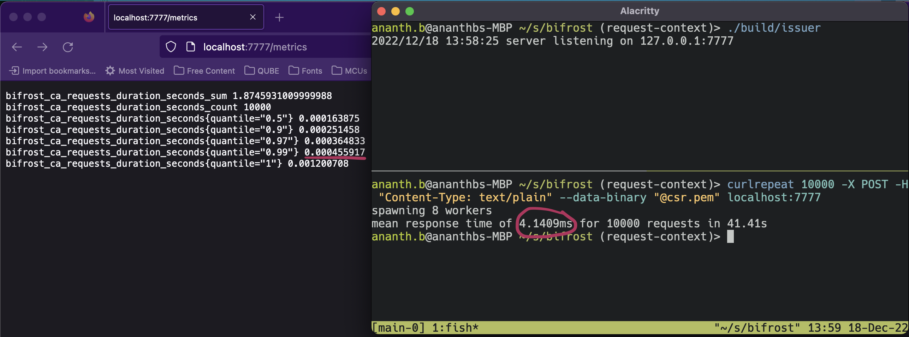

#  Bifrost

[](https://github.com/RealImage/bifrost/actions/workflows/ci.yml)

A simple mTLS authentication toolkit.

Bifrost consists of a Certificate Authority (CA) server that issues X.509 certificates,
a Go package to fetch such certificates, and a Go package with HTTP middleware
to identify and authenticate clients using such TLS certificates in requests.

Bifrost CA does not authenticate certificate signing
requests before issuance. You must authorise or control access to Bifrost CA as needed.

Bifrost CA issues certificates signed by a private key and a TLS X.509 certificate.
A TLS reverse proxy can use the issuing certificate to authenticate clients and secure
access to web applications.
Bifrost identifies clients uniquely by ECDSA public keys.
Client identity namespaces allow Bifrost to be natively multi-tenant.

## Releases

[](https://github.com/RealImage/bifrost/actions/workflows/release.yml)

Bifrost binaries are available on the [releases](https://github.com/RealImage/bifrost/releases)
page.

[bifrost](ghcr.io/realimage/bifrost) container image on ghcr.io contains all binaries.

```console
podman pull ghcr.io/realimage/bifrost
```

## Identity

Bifrost identities are UUID version 5 UUIDs, derived from ECDSA public keys.
A client's identity is the sha1 hash of the namespace appended to the X and Y
curve points (big-endian) of its ECDSA P256 public key.

In pseudo-code,

`bifrostUUID = UUIDv5(sha1(NamespaceClientIdentity + PublicKey.X.Bytes() + PublicKey.Y.Bytes())`

## Components

## [`bf`](cmd/bf) (alpha)

`bf` is an interactive tool that generates Bifrost CA material.
It uses [Charm Cloud](https://charm.sh/cloud/) to store your key material securely
in the cloud.

### [`bfid`](cmd/bfid)

`bfid` prints the Bifrost UUID of a certificate, public key, or private key.

### [`bouncer`](cmd/bouncer)

`bouncer` is a simple mTLS reverse proxy suitable for local development.
If client authentication succeeds, bouncer proxies the request to the backend url.
The client's TLS certificate is available in the `x-amzn-request-context` header.

Bouncer will log TLS Pre-Master secrets to a file if the `SSLKEYLOGFILE`
environment variable is present. [Wireshark](https://www.wireshark.org)
can use this file to decrypt traffic.

Sample Request Context containing Client Certificate:

```json
"requestContext": {
    "authentication": {
        "clientCert": {
            "clientCertPem": "-----BEGIN CERTIFICATE-----\nMIIEZTCCAk0CAQEwDQ...",
            "issuerDN": "C=012d325d-6a4e-4076-b49a-a3e84e52bf79,O=765e4c02-b41a-4226-8522-2a52f4fbeebe",
            "serialNumber": "1",
            "subjectDN": "C=2ef463c4-cca9-4885-a8e2-d041c90d61fa,O=765e4c02-b41a-4226-8522-2a52f4fbeebe",
            "validity": {
                "notAfter": "Aug  5 00:28:21 2120 GMT",
                "notBefore": "Aug 29 00:28:21 2020 GMT"
            }
        }
    },
}
```

Run `bouncer` in front of a HTTP server listening on localhost port 5000:

```bash
env BACKEND_URL=http://127.0.0.1:5000 ./bouncer
```

### [`issuer`](cmd/issuer)

[OpenAPI schema](docs/issuer-openapi.yml)

`issuer` accepts certificate requests and returns signed certificates.
It reads a list of CA certificates and keys from the `CRTS` and `KEYS` environment
variables respectively. Each variable is a comma-separated list of URIs to PEM-encoded
certificates or keys. Certificates must be valid Bifrost certificates.
Certificates and keys must be supplied in pairs.

Each namespace has its own certificate authority. The namespace is the first path
component of the request URL. Clients must send certificate requests to the correct namespace URL.
Certificate requests must be signed by an ECDSA P256 private key using the
ECDSA SHA256 signature algorithm.

`issuer` can read its signing certificates and private keys in PEM DER ASN.1 form,
from a variety of sources.
If unconfigured, it looks for `crt.pem` and `key.pem` in the current working directory.

`issuer` returns a list of issuing namespaces, one per line, at `/namespaces`
If enabled, `issuer` exposes prometheus format metrics at `/metrics`.

#### [Web Application](web) (alpha)

`issuer` includes an embedded web application that can generate private keys and request
certificates from the API. Enable it by setting `WEB=true` in the issuer process's environment.

Setting `web=dev` instead causes `issuer` to serve the application from the local filesystem
instead of from the `embed.FS` instance. This is useful for development, when combined
with `npm run build -- --watch` ran in the [web](web) directory.

## Build

### Native

Install Node.js & Go.
Build static binaries on your machine.

```console
pushd web
npm ci
popd

mkdir build
go generate -x ./...
env CGO_ENABLED=0 go build -o build ./...
```

### Container

Build all binaries.

```console
podman build -t ghcr.io/realimage/bifrost .
```

Build the CA container with the AWS Lambda Web Adapter extension.

```console
podman build -f ca.Containerfile -t bifrost-ca .
```

## Run Issuer CA

0. Generate a new namespace UUID

    `export BF_NS=$(uuidgen)`

1. Create ECDSA P256 Private Key in PEM format:

    `openssl ecparam -out key.pem -name prime256v1 -genkey -noout`

2. Create 10 year self-signed "CA" certificate:

   ```console
   openssl req -new -key key.pem -x509 -nodes \
     -days 3650 \
     -subj "/CN=$(bfid -ns "$BF_NS" key.pem)/O=$BF_NS" \
    -addext "subjectAltName = DNS:localhost" \
    -out crt.pem
   ```

3. Run the binary:

    `issuer`

4. Generate a new client identity key:

    `openssl ecparam -out clientkey.pem -name prime256v1 -genkey -noout`

5. Create a Certificate Signing Request with the client private key:

   ```console
   openssl req -new -key clientkey.pem -sha256 \
     -subj "/CN=$(bfid -ns "$BF_NS" clientkey.pem)/O=$BF_NS" \
     -out csr.pem
   ```

6. Fetch signed certificate from the CA:

   ```console
   curl -X POST -H "Content-Type: text/plain" --data-binary "@csr.pem" \
     "localhost:8888/$BF_NS/issue" >clientcrt.pem`
   ```

7. Admire your shiny new client certificate (optional):

   ```console
   $ openssl x509 -in clientcrt.pem -noout -text
   Certificate:
       Data:
           Version: 3 (0x2)
           Serial Number: 871355257622038992 (0xc17acfd7bbb09d0)
           Signature Algorithm: ecdsa-with-SHA256
           Issuer: CN = 46d6516e-715f-5a8a-8523-c2924b2a53d7, O = 00000000-0000-0000-0000-000000000000
           Validity
               Not Before: Jul 12 23:09:46 2023 GMT
               Not After : Jul 13 00:09:46 2023 GMT
           Subject: O = 00000000-0000-0000-0000-000000000000, CN = 8b9fca79-13e0-5157-b754-ff2e4e985c30
           Subject Public Key Info:
               Public Key Algorithm: id-ecPublicKey
                   Public-Key: (256 bit)
                   pub:
                       04:84:4a:3b:fa:2e:dd:07:d5:a7:96:26:68:ac:81:
                       16:8a:cb:57:02:0a:c7:ae:d3:b3:da:b5:b4:2d:a5:
                       c8:65:c2:4d:88:45:00:5a:44:f3:30:52:ab:63:42:
                       59:3d:50:68:50:45:e0:60:61:e1:57:b8:5c:dc:87:
                       7f:f9:7e:07:f6
                   ASN1 OID: prime256v1
                   NIST CURVE: P-256
           X509v3 extensions:
               X509v3 Key Usage: critical
                   Digital Signature
               X509v3 Extended Key Usage: 
                   TLS Web Client Authentication
               X509v3 Authority Key Identifier: 
                   CA:2F:94:0D:43:FB:6D:00:66:09:50:4C:8C:1F:A3:BC:C1:EF:98:F4
       Signature Algorithm: ecdsa-with-SHA256
       Signature Value:
           30:45:02:21:00:a3:2a:99:6e:29:b6:97:61:55:ac:a5:96:9c:
           ab:c3:86:44:4e:86:f5:1f:56:34:49:a7:36:b5:6c:db:72:65:
           a6:02:20:14:a9:d2:07:d5:63:17:d5:e0:3b:e3:f7:ef:e7:d0:
           65:86:c3:74:5e:b4:61:87:cd:af:6a:71:af:cd:cf:45:8b
   ```

## Fishy Benchmarks

A toy benchmark for your favourite toy CA.



`issuer` issued 10,000 certificates on my Macbook Pro M1 Pro in ~41s.
The slowest request completed in 12ms.
With a mean response time of 4ms this is objectively the fastest CA on the planet.
Statisticians hate this one weird trick.

## [LICENSE](LICENSE)

Bifrost is distributed under the terms of the Mozilla Public License 2.0.

Qube Cinema © 2023
