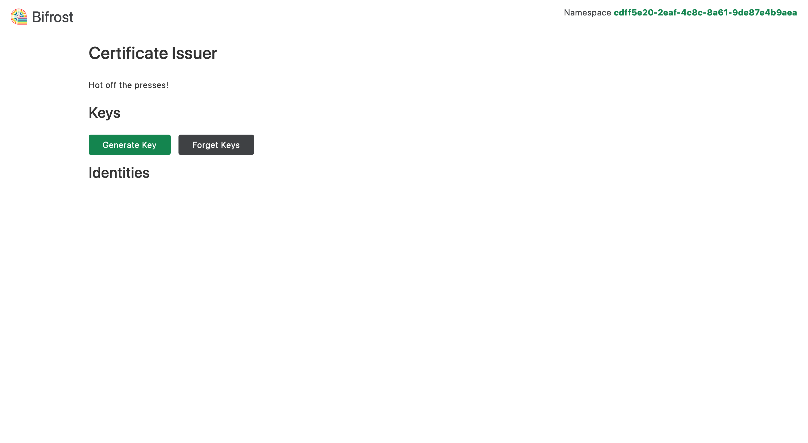
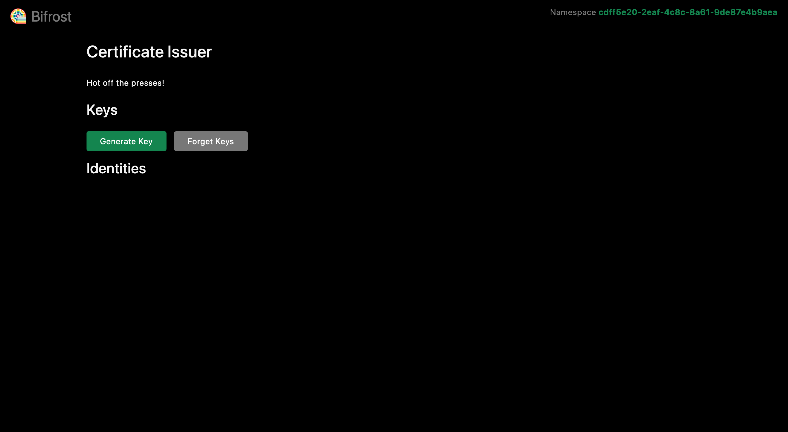

# Bifrost Issuer Web

Bifrost Issuer Web is a web site for creating private keys and issuing certificates.
It uses [htmx.org](https://htmx.org) for the user interfaces and 
[hyperscript](https://hyperscript.org) for interactivity.

## Screenshots

### Light mode (default)



### Dark mode



## Development

You'll need [Node.js](https://nodejs.org) and [NPM](https://www.npmjs.com) installed.

Install dependencies and run esbuild in watch mode:

```bash
npm install
npm run dev
```

Start `issuer` by running `env WEB=dev go run cmd/issuer/main.go`
in the root directory of the project. If `WEB` is set to `dev`, `issuer` will
serve static files from the [static](static) directory. Otherwise, if `WEB` is
a truthy value, `issuer` will serve static files from the embedded filesystem.

### Examples

```console
# Run in project root

# Serve static files from filesystem
env WEB=dev go run cmd/issuer/main.go

# Serve static files snapshot of filesystem embedded during build
env WEB=1 go run cmd/issuer/main.go

# Disable web interface
go run cmd/issuer/main.go
# or
env WEB=0 go run cmd/issuer/main.go
```
